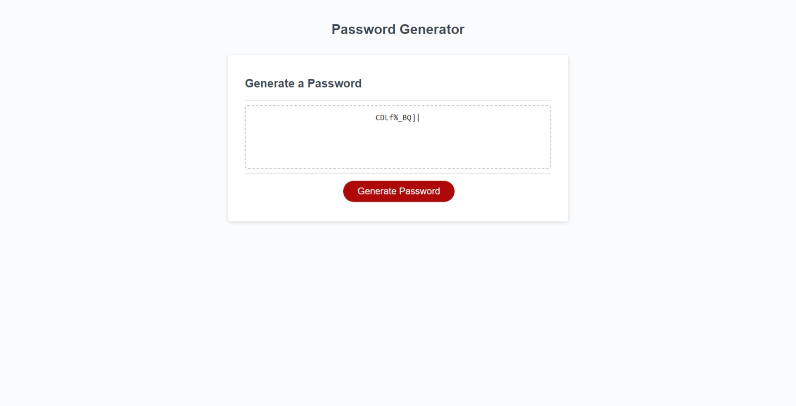

# Password Generator 

## Description
This is a random and secure password generator based on minimal requirements, as well as a list of option the user can choose from. The purpose of this is to better understand and practice JavaScript logic, focusing on the use of funtions, loops, and methods for the desired result.  The parameters of the password is that the length be at least 8 characters and no more than 128. Following that, the user can pick from upper case, lower case, numbers, and/or special characters to be used in the generation. This was 

### Credits
I received guidance from my TA Nick S, as well as class support from Maury Hughes and Jorden Heersink. I also worked with multiple learning assistants through BCS to ensure my understanding. 

#### Screenshot

### URL
https://vicswain.github.io/Password-Generator/
